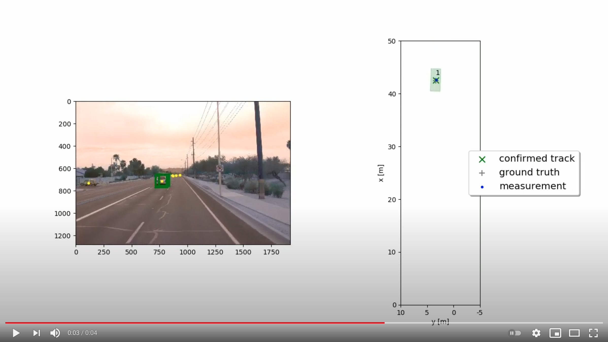
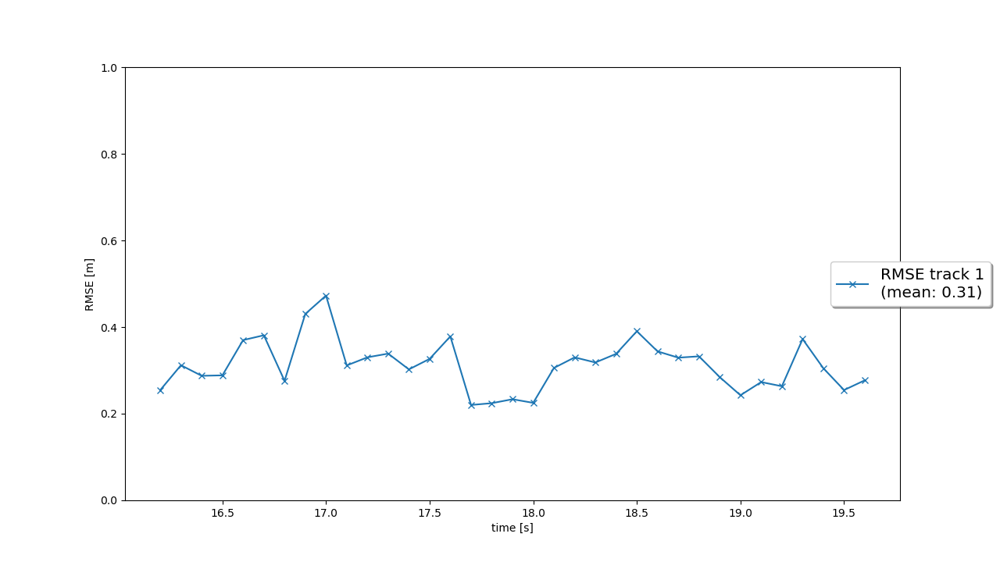
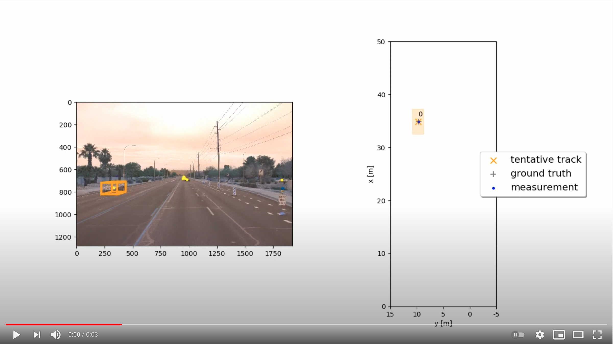
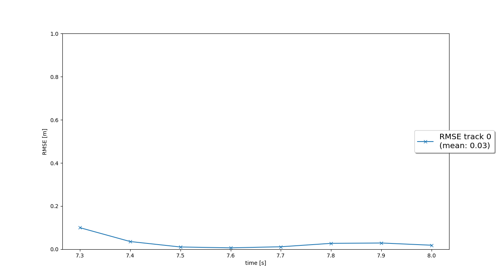
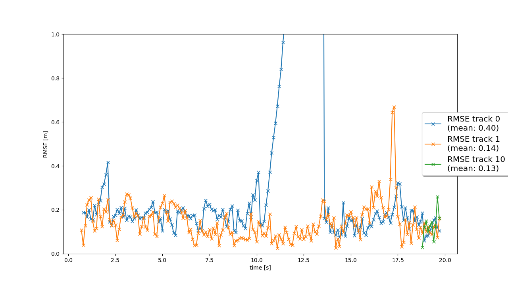
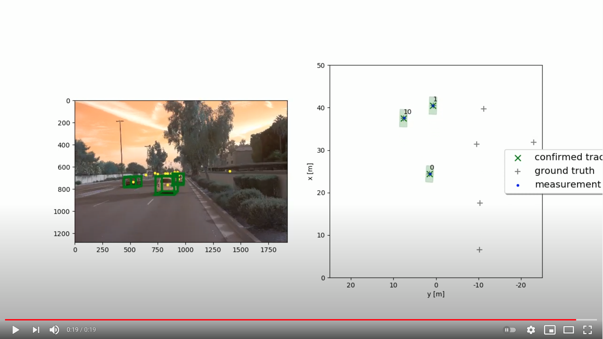
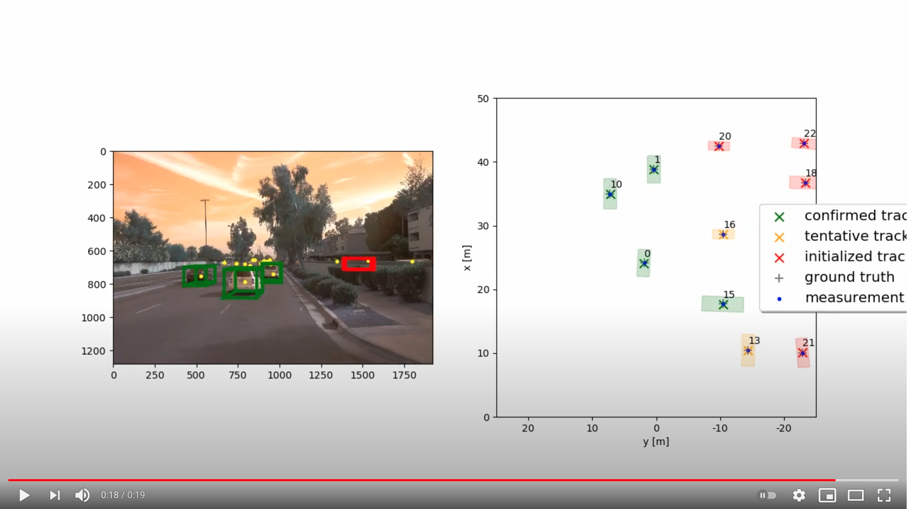
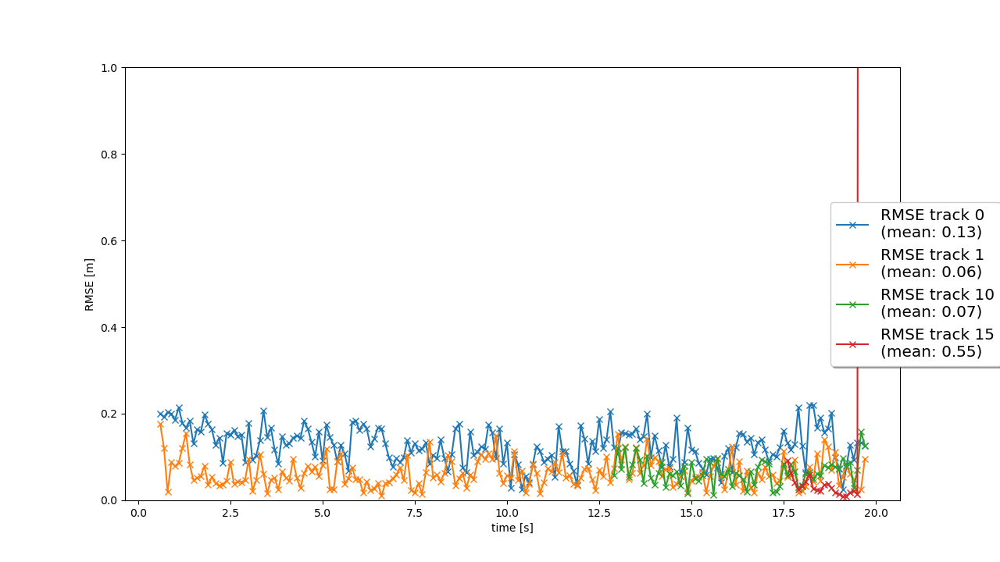
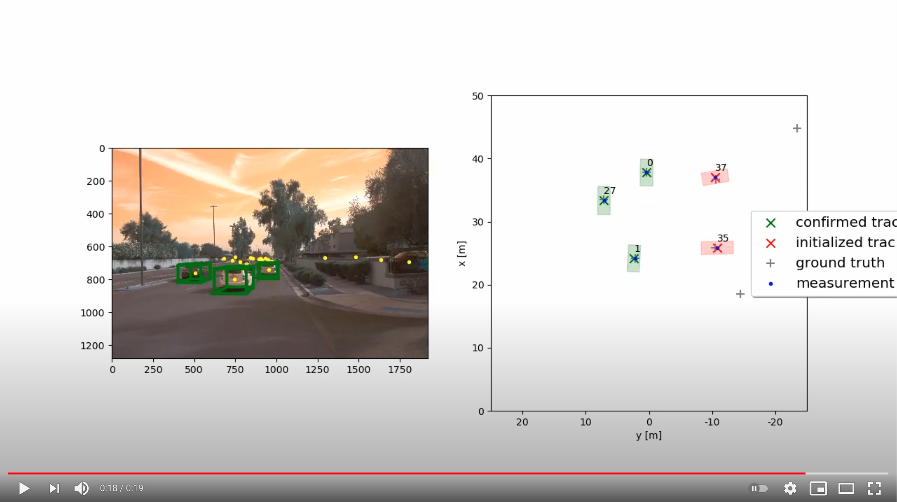
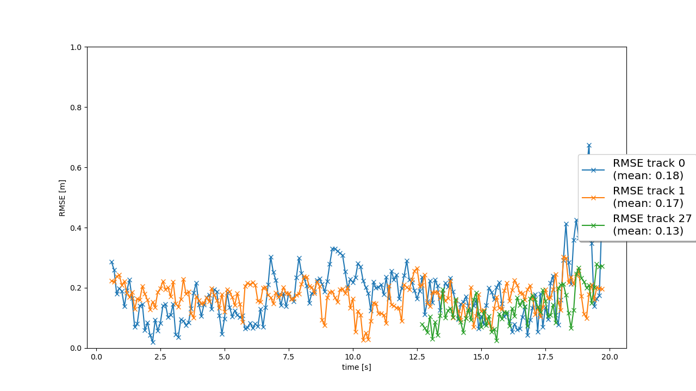

# Sensor Fusion and Object Tracking
Self-Driving Car Engineer Nanodegree 
https://www.udacity.com/course/self-driving-car-engineer-nanodegree--nd013

## Installation Instructions

Download or clone this github repository with the starter code:
https://github.com/udacity/nd013-c2-fusion-starter

Follow all the installation instructions in the github repository:
https://github.com/udacity/nd013-c2-fusion-starter#installation-instructions-for-running-locally

Basically, you need to install Python 3.7 and all the requirements in the file `requirements.txt` by typing this command in the terminal: `pip3 install -r requirements.txt`.

Additionally, you need to download and install the "Waymo Open Dataset Files" and the Pre-Trained Models for `darknet` <https://drive.google.com/file/d/1Pqx7sShlqKSGmvshTYbNDcUEYyZwfn3A/view?usp=sharing> and `fpn_resnet` <https://drive.google.com/file/d/1RcEfUIF1pzDZco8PJkZ10OL-wLL2usEj/view?usp=sharing>. Once downloaded, please copy the model files into the paths `/tools/objdet_models/darknet/pretrained` and `/tools/objdet_models/fpn_resnet/pretrained` respectively.

Moreover, download the precomputed results for `darknet` and `fpn_resnet` in this link <https://drive.google.com/drive/folders/1-s46dKSrtx8rrNwnObGbly2nO3i4D7r7?usp=sharing>. And then unzip them into the folder `/results`.

Once you completed the first steps to install this project, it is time to download the following files in this github repository and to copy them in the following directories:

| FILES TO COPY | DIRECTORIES |
| ------------- | -------------|
| [`/student/loop_over_dataset_f4.py`](/student/loop_over_dataset_f4.py) | `/` |
| [`/student/association.py`](/student/association.py) | `/student/` |
| [`/student/filter.py`](/student/filter.py) | `/student/` |
| [`/student/measurements.py`](/student/measurements.py) | `/student/` |
| [`/student/objdet_detect.py`](/student/objdet_detect.py) | `/student/` |
| [`/student/trackmanagement.py`](/student/trackmanagement.py) | `/student/` |
| [`/student/params.py`](/student/params.py) | `/misc/` |
| [`/student/evaluation.py`](/student/evaluation.py) | `/misc/` |

Note: The directory `/` is relative to this project's directory.

Now that you have successfully installed this project, you can run it by using this command `python loop_over_dataset_f4.py`.

## Questions to Answer

### Write a short recap of the four tracking steps and what you implemented there (EKF, track management, data association, camera-lidar sensor fusion). Which results did you achieve? 

**Step 1. Extended Kalman Filter (EKF):** I implemented a complete Kalman filter with 6 dimensions: 3 dimensions for the position (x, y, z) and 3 dimensions for the velocity (vx, vy, vz). According to Prof. Thrun, this is a great achievement because it is the most important part of a tracking system with sensor fusion support. It was difficult for me to know when to use `H * x` and when to use `hx`. The later `hx` is only used when computing gamma and when computing the Mahalanobis Distance (MHD). And I spent a lot of time tuning the 6 x 6 matrixes returned by `P()` and `Q()`. I think I found an almost optimal configuration for this project.

**Step 2. Track Management:** I programmed a module to create new tracks, delete old tracks, and update the states of current tracks, based on the information obtained by the measurements. In my new version, I used a dictionary whose keys are the frames and whose values are lists that accumulate the presence or absence of camera measurements and lidar measurements. This approach is more robust because it does not penalize the track when it receives measurements from only 1 sensor, lacking measurements from the other sensor. And this approach accelerates the confirmation of tracks when measurements from both sensors are present. Analyze my code for this part.

**Step 3. Data Association:** The algorithm to associate tracks with measurements is very clever because it matches the nearest pair of track and measurement in the space formed by the Mahalanobis Distance (MHD), which is a space deformed by the statistical expectations of positions and velocities. And the algorithm continues to match the nearest pairs until there are no pairs to match.

**Step 4. Camera-Lidar Sensor Fusion:** This is the final step to complete the whole sensor fusion system. Coordinates from 2 different sensors with different geometries are transformed into vehicle coordinates by using the homogeneous transformation matrices. In like manner, vehicle coordinates are transformed into the corresponding sensor coordinates in order to compute `hx` and the EKF's Jacobian. In this step, I was confused about how to activate the camera measurements. Because they were not active in spite of following the instructions correctly. I searched for all the conditional statements like `if sensor.name == 'lidar':` and I changed them to `if sensor.name in ['lidar', 'camera']:` with disastrous results. Finally, I noticed that such changes were not necessary. Because I forgot to use `hx` when computing the Mahalanobis Distance (MHD). Using `H * x` when computing MHD led to discarding all camera measurements.

### Which part of the project was most difficult for you to complete, and why?

For me, the most difficult part of the project was to fully understand the overall structure of the project. In addition to completing all the TODOs, I also needed to read the source code of all the Python files in the whole project. Because the TODOs asked me to do many things that were confusing and ambiguous. I didn't know how to complete many TODOs. The devil is in the details. And by reading and understanding all the source files, I finally completed the project. The real problem is this project has many mutually-interacting synergistic parts. And if you program one part in a wrong way, the whole project fails. So, it's very demotivating to see that nothing in this project works well. But I knew that it was my fault. I knew that I programmed many parts in a wrong way. So, I printed and printed all the intermediate results, validating that everything is well programmed as intended. In this way, I got everything correct and now the project finally works.
    
### Do you see any benefits in camera-lidar fusion compared to lidar-only tracking (in theory and in your concrete results)?

In theory, cameras have more resolution and more frames per second than lidar. Hence, cameras are better at detecting objects in the environment, resolving ambiguities.

In my concrete results, I experienced a significant improvement in the accuracy when I finished implementing the Step 4, which fuses lidar measurements with camera measurements. Resolving the ambiguities of the video in Step 4 would be very difficult without camera measurements.

Camera measurements are ambiguous in the lines of ray tracing. Throughout these lines, any depth is valid and ambiguous. This ambiguity is resolved by using lidar measurements which have accurate depth information. Moreover, in the project there were big gaps of false negatives, lack of some lidar measurements. So, the fusion of cameras and lidars compensate their weaknesses.
    
### Which challenges will a sensor fusion system face in real-life scenarios? Did you see any of these challenges in the project?

Cameras are less accurate at night and at estimating distances. Hence, sensor fusion systems must deal with these inaccuracies. Fortunately, the EKF has the mathematical foundations to deal with noisy measurements properly.

Yes, I saw in the project that camera measurements were less accurate than lidar measurements. Fortunately, theses cameras recorded videos in the day, not in the night, which would make this project harder.

### Can you think of ways to improve your tracking results in the future?

I used precomputed detections in this project. And these precomputed detections provided by Udacity had lots of false negatives, lots of ground-truth labels without measurements. The gaps in the frames are big. I'm not exaggerating. Perhaps I should compute my own detections by using my own code. I hope to improve my results in this way.

Moreover, I should try the "Stand Out Suggestions":

- Fine-tune your parameterization and see how low an RMSE you can achieve! One idea would be to apply the standard deviation values for lidar that you found in the mid-term project. The parameters in `misc/params.py` should enable a first running tracking, but there is still a lot of room for improvement through parameter tuning!
- Implement a more advanced data association, e.g. Global Nearest Neighbor (GNN) or Joint Probabilistic Data Association (JPDA).
- Feed your camera detections from Project 1 to the tracking.
- Adapt the Kalman filter to also estimate the object's width, length, and height, instead of simply using the unfiltered lidar detections as we did.
- Use a non-linear motion model, e.g. a bicycle model, which is more appropriate for vehicle movement than our linear motion model, since a vehicle can only move forward or backward, not in any direction.

## Results

**[SDCE ND] Sensor Fusion and Object Tracking (Step 1, Resnet) [Submission 2]** 
https://youtu.be/d9EZSFHPsio

The tracker (EKF) follows the car smoothly.

**RMSE through time (Step 1)** 

And the mean RMSE is 0.31, below 0.35 as the rubric requested.

**[SDCE ND] Sensor Fusion and Object Tracking (Step 2, Resnet) [Submission 2]** 
https://youtu.be/Gc0H8hfHD-c

EKF follows this fast car without problems. At the end, the tracker deletes the track once it falls outside the field-of-view. However, the tracker takes some time until it finally confirms the track. Why? I programmed the tracker to be skeptical enough to reject the ghosts tracks in Step 4. 

**RMSE through time (Step 2)** 

The mean RMSE of this track is 0.03, which is very good!

**RMSE through time (Step 3)** 

Step 3 is the same experiment in Step 4. So, I didn't upload a video of Step 3. And I will explain the RMSEs of Step 3 in Step 4.

**[SDCE ND] Sensor Fusion and Object Tracking (Step 4, Resnet) [Submission 2]** 
https://youtu.be/k-RrG9VT9Kk

EKF follows the 2 important cars smoothly without problems. But in the time period from second 10th to second 13th, where there are no lidar measurements in 1 car, the mean RMSE increases slightly. In this part, EKF predicts the car movements in an imperfect way, given there are no lidar measurements. After that, the car recovers its lidar measurements and its tracking. Notice that in the video I draw the camera measurements in yellow. In spite of the lack of lidar measurements, EKF updates the track with camera measurements, preventing the track from being deleted. However, camera measurements are ambiguous in the lines of ray tracing. Throughout these lines, any depth is valid and ambiguous. And that's why, without lidar measurements, the error followed the line of ray tracing. Watch the video.

This error is not my fault because the precomputed results of `fpn_resnet` that Udacity gave us lack many lidar measurements in big gaps. Fortunately, I did my best to follow the 2 important cars from the beginning to the end, without losing the track. And I obtained a decent mean RMSE for the 2 important cars: 0.40 and 0.14.

I debugged extensively this part. I thought I was not using camera measurements properly. But I tracked the flow of measurements throughout all the functions and I noticed that at most 1 lidar measurement and 1 camera measurement are being matched to each track in each frame. I changed the calculations of camera measurements slightly, changing signs and adding some quantities, producing disastrous errors. It means that my formulas without slight modifications are correct.

**RMSE through time (Step 4)** 

Track 0 (blue) and track 1 (orange) are the 2 important cars whose tracking was never lost. Track 0 (blue) increases its RMSEs slightly from second 10th to second 13th, when there are no lidar measurements. Track 10 (green) is the black car whose precomputed detections shown no lidar measurements until second 18th.

**[SDCE ND] Sensor Fusion and Object Tracking (Step 4, Ground Truth) [Submission 2]** 
https://youtu.be/Dl25MHOwtD8

When I use ground-truth labels, my tracker works perfectly and follows the 2 important cars, Track 0 (blue) and track 1 (orange), from the begining to the end with mean RMSEs of 0.13 and 0.06, as the rubric requested. Track 10 (green) is the black car that appeared in the middle of the video and it was not fully confirmed until both lidar measurements and camera measurements intersected the fields of view. Track 15 (red) is a car parked in the right side at the end of the video.

**RMSE through time (Step 4 with ground-truth labels)** 

**[SDCE ND] Sensor Fusion and Object Tracking (Step 4, Darknet) [Submission 2]** 
https://youtu.be/AiZo0Lup4XI

When I used the precomputed detections of `darknet`, lidar measurements have no big gaps of false negatives. And I obtained almost perfect results as the rubric requested. My tracker works perfectly and follows the 2 important cars, Track 0 (blue) and track 1 (orange), from the begining to the end with mean RMSEs of 0.18 and 0.17. Track 27 (green) is the black car that appeared in the middle of the video. There are only 3 confirmed tracks with mean RMSEs below 0.25. And all ghosts tracks were eliminated. My graph with only 3 confirmed tracks is very similar to the graph requested by the rubric. I'm so happy with my results now.

**RMSE through time (Step 4 with Darknet)** 

## Note for the reviewer:

I'm a reviewer candidate and my opportunity to obtain this certification expires in 1 day. I don't know if Christopher will extend my deadline. So, please be kind when grading this project. Notice that the precomputed detections given by Udacity have big gaps of false negatives. I did my best at tuning the parameters and algorithms of this project. However, the mean RMSE of Step 4 is slightly above of what the rubric asks. That's why I use ground-truth labels to fulfill the mean RMSE requested by the rubric. And I programmed on purpose the behavior of not deleting old tracks too soon. Otherwise, I wouldn't be able to track the 2 important cars from begining to end without losing their track.

Here is the github repository of my solution: https://github.com/jckuri/Sensor-Fusion-and-Object-Tracking-2
